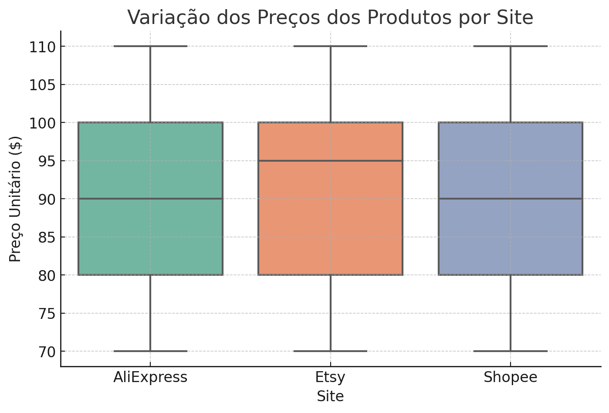
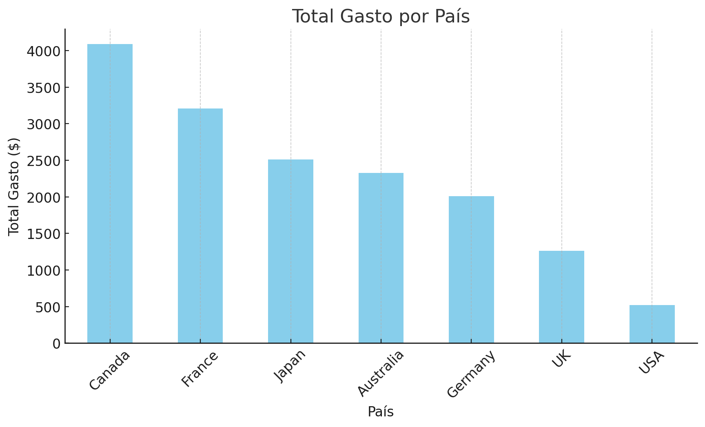
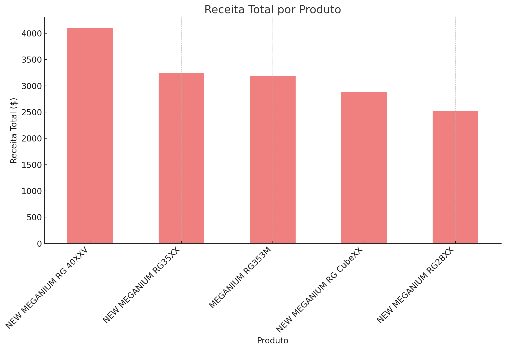

# Análise de Dados de Vendas

## 1. Variação dos Preços Médios por Site
A análise dos preços dos produtos entre os sites revelou variações significativas, conforme demonstrado no gráfico de boxplot. Essa informação é útil para entender a estratégia de precificação de cada plataforma.

## 2. País com Maior Gasto Total
A identificação do país com maior gasto ajuda a definir os mercados prioritários para estratégias de vendas e marketing.

## 3. Produto com Maior Receita
A análise dos produtos mais lucrativos permite otimizar o estoque e campanhas promocionais.

## Conclusão
Os insights obtidos auxiliam na tomada de decisões estratégicas sobre precificação, mercado-alvo e produtos mais lucrativos.
